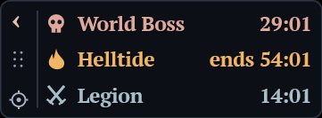

# Sanctuary Timers

A compact native Windows overlay for Diablo IV's World Boss, Helltide and Legion timers.



## Install on Windows

Download and run [Install-SanctuaryTimers.ps1](https://github.com/ihor-sokoliuk/sanctuary-timers/releases/latest/download/Install-SanctuaryTimers.ps1), or use Windows PowerShell:

```powershell
Invoke-WebRequest -UseBasicParsing -Uri 'https://github.com/ihor-sokoliuk/sanctuary-timers/releases/latest/download/Install-SanctuaryTimers.ps1' -OutFile "$env:TEMP\Install-SanctuaryTimers.ps1"
powershell.exe -NoProfile -ExecutionPolicy Bypass -File "$env:TEMP\Install-SanctuaryTimers.ps1"
```

The installer downloads the latest stable release, verifies its SHA-256 checksum, and installs it into `%LOCALAPPDATA%\Programs\SanctuaryTimers`. It adds a Start menu entry and an entry under Windows Installed apps. An on-demand Task Scheduler task launches it independently of the installer, terminal, or Codex. No administrator password is needed.

Automatic startup remains under **Task Manager > Startup apps > Sanctuary Timers**. The task has no automatic triggers, so disabling startup in Task Manager is respected. Existing settings and cache survive updates. To move a previous portable copy, add `-MigrateFrom 'C:\path\to\portable-folder'`; use `-Version 0.1.3` to select a release or `-NoStart` to install without launching it.

Run the installer again to update. Uninstall through Windows Installed apps, or run the installed script with `-Uninstall`. Uninstall preserves preferences/cache and an ownership marker, allowing a later reinstall. Failed updates retain `SanctuaryTimers.previous.exe` for recovery; if rollback cannot finish, the installer reports that path.

The [release page](https://github.com/ihor-sokoliuk/sanctuary-timers/releases/latest) also provides a portable ZIP and checksum manifest.

## Play with the overlay

Place `SanctuaryTimers.exe` in a writable folder you intend to keep, then run it. Use Diablo IV in Windowed Fullscreen. The panel appears when Diablo is foreground and hides when another application takes focus.

Game launch and restore detection uses Windows notifications, with short bounded retries while the window is initializing. It does not continuously poll for focus or activate the game for you.

The left strip contains collapse/expand, drag, and settings. The timer area lets clicks pass to the game. Settings open inside the panel: adjust text size, width, and background opacity with the minus/plus controls. Text stays opaque. Appearance and position are saved beside the executable.

All text, including event names, timers and appearance settings, uses embedded PT Serif Bold with a subtle dark shadow to match the game's serif UI style. No system font installation is needed.

Each event name matches its countdown color: red for World Boss, yellow-orange for Helltide, and blue-gray for Legion. These colors remain the same for cached/offline estimates; the `~` prefix identifies estimates without changing the event color.

Panel width adjusts in 5-pixel steps. Its minimum follows the text size, reserving enough room for all labels and countdowns plus an 8-pixel gap between their columns. At 15-pixel text the minimum panel width is 241 logical pixels; larger text raises that limit to avoid clipping.

There are no sounds, popups, flashing alerts, maps, or build tools. `Now` means the scheduled event started within the last minute; it does not claim a boss is still alive in your instance. Helltide switches between `ends` and `in` at its known boundaries. `~` marks estimated/offline data; an em dash means no trustworthy timing anchor is available.

## Start with Windows or exit

The installer (or first normal portable launch) adds **Sanctuary Timers** under **Task Manager > Startup apps**. Disable it there to stop automatic startup. The app and installer updates preserve that choice and do not recreate an entry you remove. If you move a portable folder, run the app once from the new location to update an existing startup path.

Right-click the tray icon to open appearance settings or exit. Starting it a second time does not create another panel. `SanctuaryTimers.exe --quit` also requests a graceful exit without changing focus.

## Timing and network behavior

The overlay checks its clock against `time.windows.com` at launch and then every 24 hours, including while the game is closed. It compensates for network delay and keeps time locally between checks. Corrections apply only to this app; no administrator rights or Windows time-setting changes are needed. An overdue check runs after wake. If a check fails, the previous correction remains in use (or Windows time before the first success), with retries starting after 15 minutes and backing off to six hours. Restarting the app starts a fresh clock check.

Appearance shows **Clock: synced ... (daily)** separately from **Events checked**. Event-check age is the oldest successful event-record read, not the clock's age. Clock synchronization needs outbound UDP port 123; a blocked connection is shown as a pending retry.

The app fetches three small public records used by Helltides.com. It calculates countdowns locally, then checks the affected event 20 seconds after a known start/end. It does not refresh all events every five minutes. Event requests are deferred while the game is not foreground. Failures retain cached anchors and back off from one minute to thirty minutes, honoring server retry delays.

Helltides follow the hourly 55-minute cycle. World Boss and Legion calculations use validated feed anchors and 210-minute/25-minute intervals. A changed source phase suspends extrapolation until reconfirmed. These are website feeds, not a guaranteed Blizzard API; changes can require an adapter update.

## Build and test

Windows 10 (version 1703 or newer)/11 x64. No browser engine, Python, .NET, or installed runtime is required to use the built executable.

With a portable [Zig 0.15.2](https://ziglang.org/download/) C++ compiler:

```powershell
.\build.ps1 -Zig C:\tools\zig\zig.exe -TestsOnly
.\build.ps1 -Zig C:\tools\zig\zig.exe
```

The build script runs unit tests before producing `build/SanctuaryTimers.exe`. It never launches the overlay or registers startup. Alternatively use a Visual Studio C++ toolchain:

```powershell
cmake -S . -B build-msvc -A x64
cmake --build build-msvc --config Release
ctest --test-dir build-msvc -C Release --output-on-failure
.\tests\installer_tests.ps1
.\scripts\New-ReleasePackage.ps1 -Executable .\build-msvc\Release\SanctuaryTimers.exe
```

## Implementation and privacy

The source uses C++20, Win32, Direct2D/DirectWrite, WinHTTP and Windows Sockets for SNTP time checks. Window focus/location changes arrive through out-of-context WinEvent notifications. The application does not read game memory, inject code, capture the game, or automate gameplay. There is no telemetry or update checker. `settings.ini`, `events.ini`, `diagnostics.log` and an on-demand `status.txt` remain beside the executable.

The display uses a click-through drawing surface and a tightly aligned input surface entirely within its bounds, so gameplay clicks can pass through to another process reliably. They appear as one panel and never activate themselves.

See [design](docs/design.md), [implementation plan](docs/implementation-plan.md) and [validation](docs/validation.md) for scope and measured verification. Resource usage must be measured; native code alone does not establish a performance claim.

## Attribution

Independent fan utility, not affiliated with Blizzard. Event data and schedule reference: [Helltides.com](https://helltides.com/). Existing projects, including Helltime and D4 World Boss Overlay, were researched as design references; their code and assets are not bundled. Source is MIT licensed. Compiler runtime license notices accompany binary distributions.
